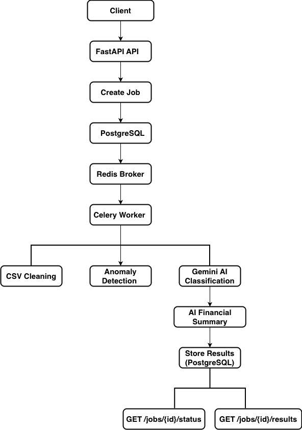
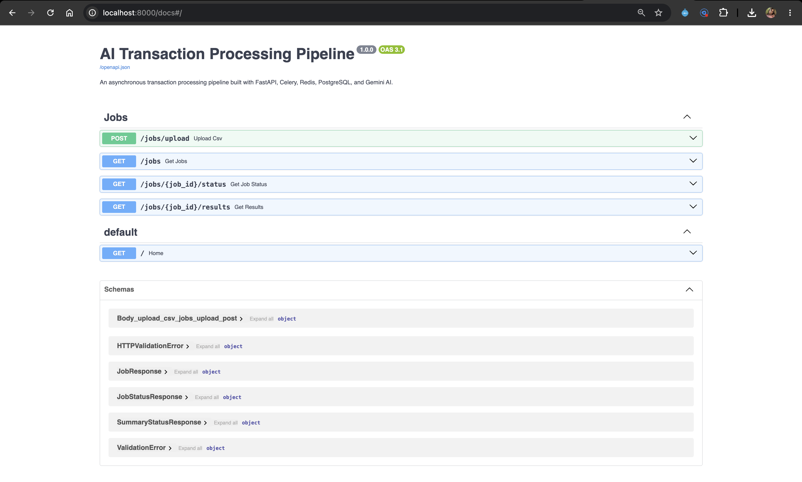
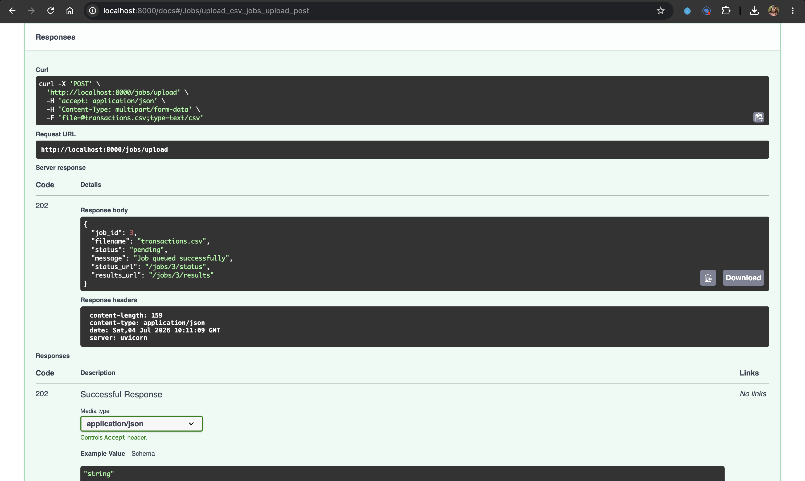
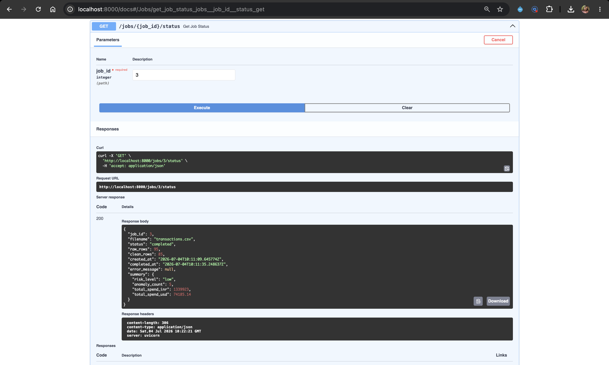
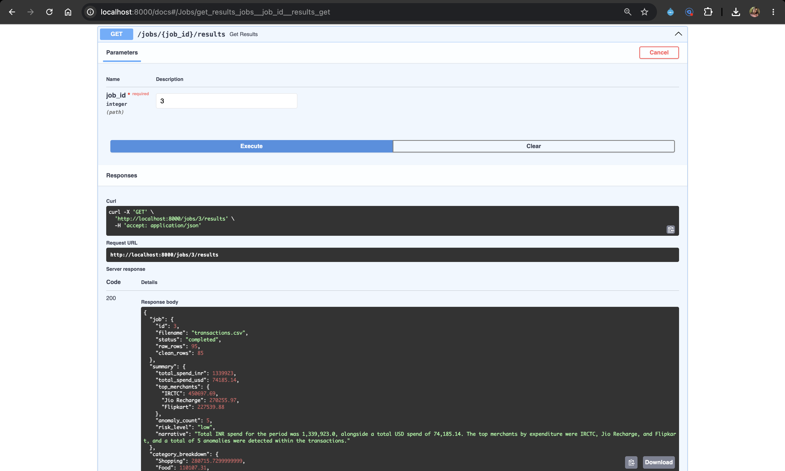
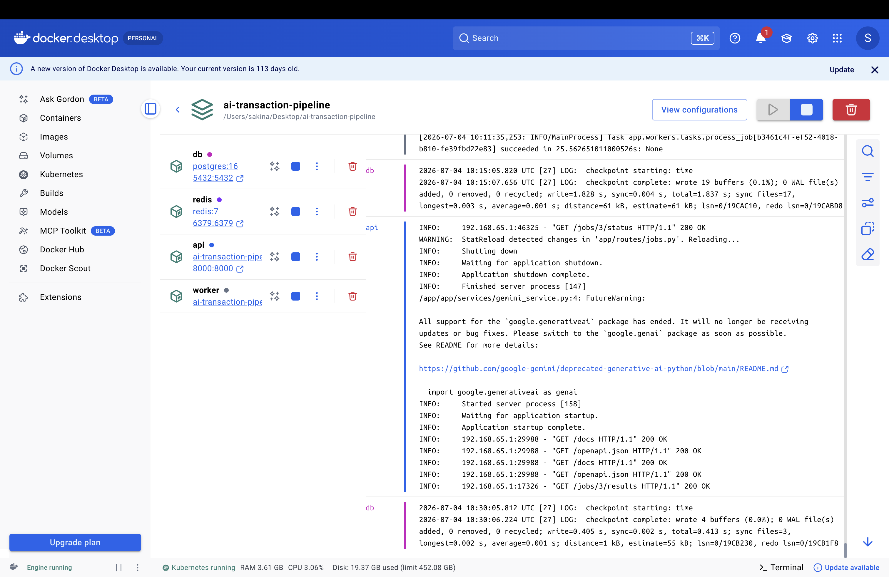

#  AI Transaction Processing Pipeline

An asynchronous AI-powered transaction processing pipeline built using **FastAPI**, **Celery**, **Redis**, **PostgreSQL**, **Docker**, and **Google Gemini AI**.

The system accepts CSV transaction files, validates and cleans the data, detects anomalies, classifies transactions using Gemini AI, generates an AI-powered financial summary, and exposes the results through REST APIs.

---

##  Tech Stack

### Backend

- FastAPI
- SQLAlchemy
- Celery
- PostgreSQL
- Redis

### AI

- Google Gemini AI

### Infrastructure

- Docker
- Docker Compose

---

##  Features

- ✅ Asynchronous CSV processing using Celery workers
- ✅ Background job queue with Redis
- ✅ PostgreSQL database for persistent storage
- ✅ Automatic CSV validation and cleaning
- ✅ Duplicate transaction removal
- ✅ Missing value handling
- ✅ Batch processing for efficient Gemini API usage
- ✅ AI-powered transaction categorization using Gemini
- ✅ AI-generated financial summary
- ✅ Anomaly detection
- ✅ Category-wise spend analysis
- ✅ Graceful fallback when AI classification fails
- ✅ Job status tracking
- ✅ REST APIs with interactive Swagger documentation
- ✅ Fully Dockerized deployment

---

##  Architecture

<p align="center">
  
</p>

---

##  API Endpoints

| Method | Endpoint | Description |
| :---: | :--- | :--- |
| **POST** | `/jobs/upload` | Upload transaction CSV |
| **GET** | `/jobs` | List all jobs |
| **GET** | `/jobs/{job_id}/status` | Job status |
| **GET** | `/jobs/{job_id}/results` | Job results |

---

##  Example cURL Requests

### Upload CSV

```bash
curl -X POST "http://localhost:8000/jobs/upload" \
-F "file=@transactions.csv"
```

### List Jobs

```bash
curl http://localhost:8000/jobs
```

### Get Job Status

```bash
curl http://localhost:8000/jobs/1/status
```

### Get Job Results

```bash
curl http://localhost:8000/jobs/1/results
```

---

##  Docker Setup

```bash
cp .env.example .env

docker compose up --build
```

### Access the API

Once all Docker services are running, the API will be available locally at:

- **Swagger UI:** `http://localhost:8000/docs`
- **OpenAPI JSON:** `http://localhost:8000/openapi.json`

---

##  Screenshots

### Swagger UI

<p align="center">
  
</p>

### Upload API

<p align="center">
  
</p>

### Job Status

<p align="center">
  
</p>

### Job Results

<p align="center">
  
</p>

### Docker Deployment

<p align="center">
  
</p>

---

##  Future Improvements

- Reduce Gemini API calls using merchant-level caching
- Intelligent retry strategy with API rate-limit awareness
- User authentication
- Dashboard
- Multi-user support
- Export reports

---

##  Author

**Sakina**

Developed as part of an **AI Transaction Processing Pipeline** assignment.

---

##  License

Educational and evaluation purposes only.